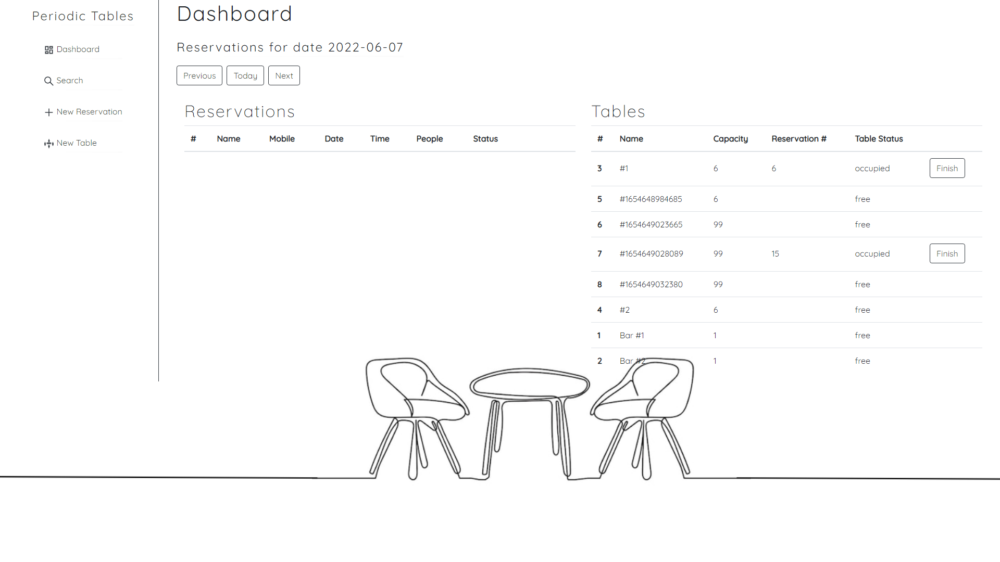
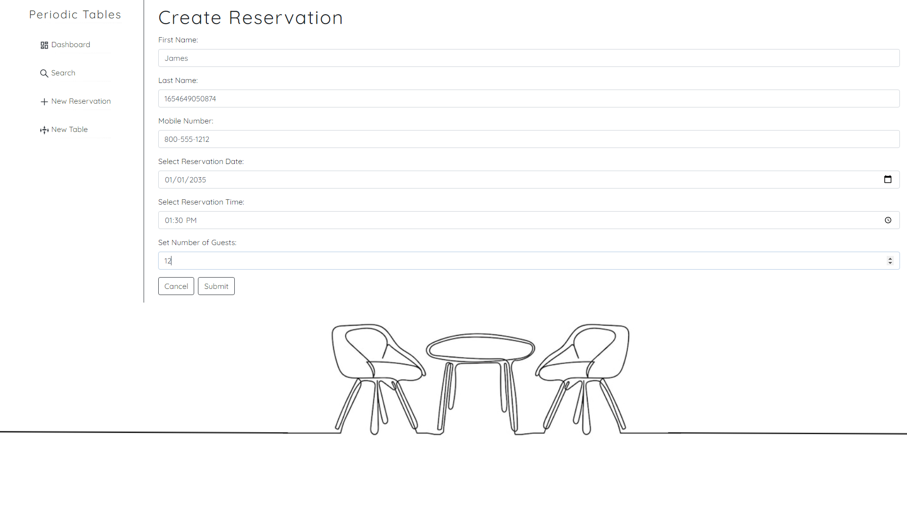
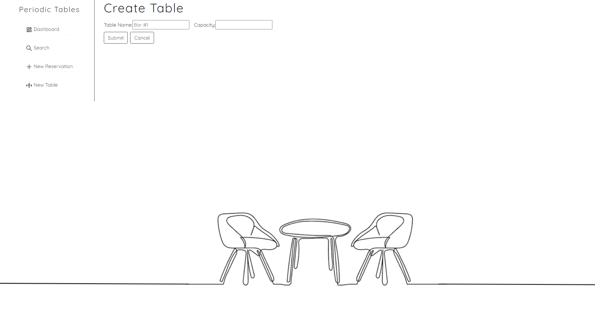
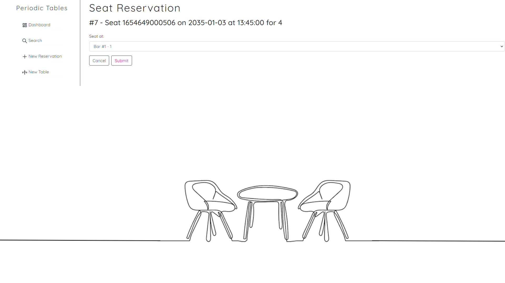
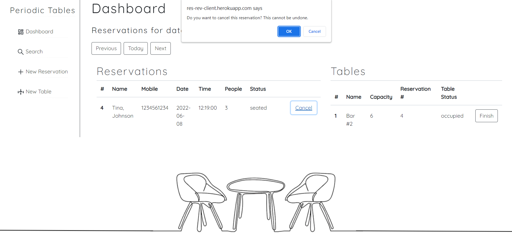
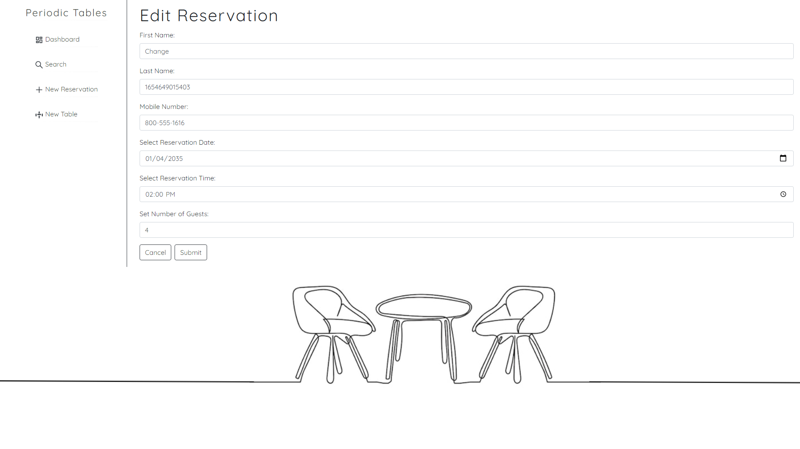

# Capstone: Restaurant Reservation System
This application was built for restaurant personnel so that they may keep track of customer reservations. It allows them to search, add, and seat reservations while also keeping track of open tables and completing reservations once finished.

Project Prompt:

You have been hired as a full stack developer at Periodic Tables, a startup that is creating a reservation system for fine dining restaurants. The Product Manager has already created 8 user stories for Periodic Tables, and another developer has already written the tests for each of the user stories.

## Technology

- Built with React.js, JSX, HTML, CSS, Bootstrap, Expressjs, Node.js, Git, Heroku, ElephantSQL, PostgreSQL, and Google Fonts

- This full stack application has built in unit, integration, and e2e tests. Each test is split up by user story. To install this application, you must:

	- Fork and Clone this repository.
	- Run cp ./back-end/.env.sample ./back-end/.env.
	- Update the ./back-end/.env file with the connection URL's to your ElephantSQL database instance.
	- Run cp ./front-end/.env.sample ./front-end/.env.
	- You should not need to make changes to the ./front-end/.env file unless you want to connect to a backend at a location other than http://localhost:5001
	- Run npm install to install project dependencies.
	- Run npm run start:dev to start your server in development mode
	- Additionally, tests for this application can be run for this application for each User Story by running npm run test:X where X is the user story number.
## Links

[Deployed Version](https://res-rev-client.herokuapp.com/dashboard)

[API](https://res-rev-backend.herokuapp.com/tables)

## Screenshots 
### Dashboard:

The Dashboard is located at /dashboard and has the following features:

- Lists all reservations for one date only. The date is defaulted to today and the reservations are sorted by time.
- Each reservation will display its status.
	- The default status is booked.
	- A "Seat" button will also be displayed for reservations that are booked.
- Each reservation displays an "Edit" and "Cancel" button.
	- Only reservations with a status of booked can be edited.
- Displays next, previous, and today buttons that allow the user to see reservations on other dates.
- Displays a list of all tables, sorted by name.
	- Each table will display "Free" or "Occupied" depending on whether or not a reservation is seated at the table.
	- Each "Occupied" table will have a "Finish" button.
- Displays any error messages returned from the API.
- 

### Create a New Reservation:

- Clicking on "New Reservation" of the Menu side bar will take the user to the /reservations/new page.
- The Create Reservation page displays a form with the following required fields: first name, last name, mobile number, date of reservation, time of reservation, and the number of people in the party.
- Clicking on the "Submit" button will save the reservation and then display the /dashboard page for the date of the new reservation.
- Clicking on the "Cancel" button will take the user to the previous page.
- While attempting to create a new reservation, any error messages returned from the API will be displayed.

### Create a New Table:

- Clicking on New Table of the Menu side bar will take the user to the /tables/new page.
- The Create Table page displays a form with the following required fields: table name and capacity.
- Clicking on the "Submit" button will save the new table and then display the /dashboard page.
- Clicking on the "Cancel" button will take the user to the previous page.
- While attempting to create a new table, any error messages returned from the API will be displayed.

### Seat a Reservation:

- When the user clicks on the "Seat" button associated with a particular reservation, the application will take the user to the Seat Reservation page.

### Finish an Occupied Table:

Clicking on the "Finish" button of an "Occupied" table will display the following confirmation:

- If the user selects "OK", the system will remove the table assignment and indicate the table is now "Free" again.
- This action will also change that reservation's status to finished and the system will remove the reservation from the Dashboard.
- Clicking "Cancel" on the confirmation dialog will make no changes.

### Cancel a Reservation:

Clicking on the "Cancel" button associated with a particular reservation will display the following confirmation:

- If the user selects "OK", the system will remove the table assignment and indicate the table is now "Free" again.
- This action will also change that reservation's status to finished and the system will remove the reservation from the Dashboard.
- Clicking "Cancel" on the confirmation dialog will make no changes.

### Edit a Reservation:

Clicking on the "Edit" button will navigate the user to the following page:

- This page will display the reservation form with the existing reservation data already filled in.
- Clicking on the "Submit" button will save the reservation and then display the updated reservation on the /dashboard page.
- Clicking on the "Cancel" button will make no changes and the user will be taken back to the previous page.

